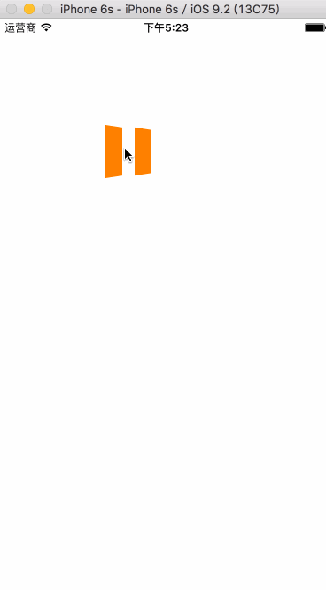

### TCPlayButton
> A Youtobe like button

### Demo
	UIButton *playBtton = [UIButton buttonWithType:UIButtonTypeTCPlay];
    playBtton.frame = CGRectMake(100, 100, 100, 100);
    [playBtton playState:NO];
    [playBtton backTintColor:[UIColor orangeColor]];
    [playBtton touchUpInside:^(BOOL play, UIButton *button) {
        NSLog(@"play - %d", play);
    }];
    [self.view addSubview:playBtton];
    
### Effect
